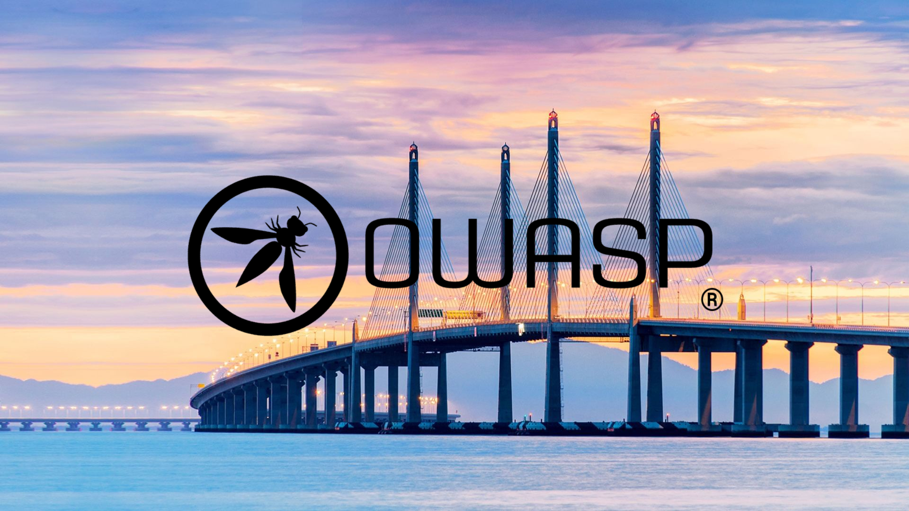

---

layout: col-sidebar
title: OWASP Penang
tags: OWASP Penang Malaysia
region: Asia
country: Malaysia
meetup-group:	OWASP-Penang-Chapter

---

## Welcome

A warm welcome from the OWASP Penang Chapter! We are dedicated to improving software security through open-source initiatives, cutting-edge research, and extensive education as members of the worldwide OWASP community. Cybersecurity experts, programmers, and enthusiasts from Penang and the neighbouring regions come together in our chapter to learn from one another, work on solutions together, and make the internet a safer place.

Anyone who is excited about and interested in application security is welcome. There are no costs to attend any meeting. **You don't need to be a member of OWASP**.

Come be a part of our thriving community by attending our next event. By working together, we have the power to revolutionise cybersecurity. View our calendar and subscribe to our mailing list to be informed about all our forthcoming projects and events. Join us at the Penang OWASP Chapter, where we are working to make the internet a safer place via community, education, and innovation. Referrals to this website or to individual meetings to colleagues or acquaintances are welcome.

# Penang Chapter Board

If you want to know more about the OWASP Penang Chapter then please mail below chapter leaders:

* [Eiman Haqimi Bin Arrifin](mailto:eiman.haqimi@owasp.org)
* [Muhammad Zaim bin Romzee](mailto:zaim.romzee@owasp.org)

## Participation
The Open Worldwide Application Security Project (OWASP) is a nonprofit foundation that works to improve the security of software. All of our projects, tools, documents, forums, and chapters are free and open to anyone interested in improving application security. 

Chapters are led by local leaders in accordance with the [Chapters Policy](/www-policy/operational/chapters). Financial contributions should only be made online using the authorized online donation button. 

Everyone is welcome and encouraged to participate in our [Projects](/projects/), [Local Chapters](/chapters/), [Events](/events/), [Online Groups](https://groups.google.com/a/owasp.com/){:target='_blank'}, and [Community Slack Channel](https://owasp.slack.com/){:target='_blank'}. We especially encourage diversity in all our initiatives. OWASP is a fantastic place to learn about application security, to network, and even to build your reputation as an expert. We also encourage you to be [become a member](/membership/) or consider a [donation](/donate/) to support our ongoing work.

Next Meeting/Event <!-- You should keep this section as it will populate your meetup events -->
---------------------



