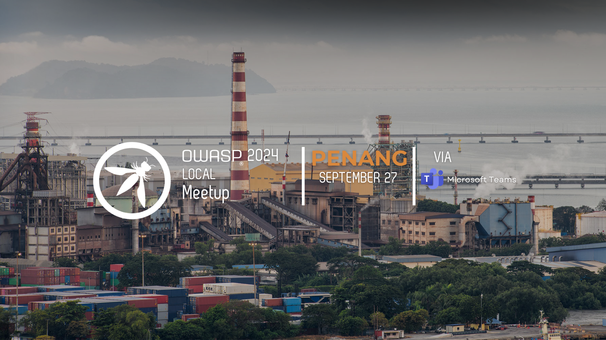
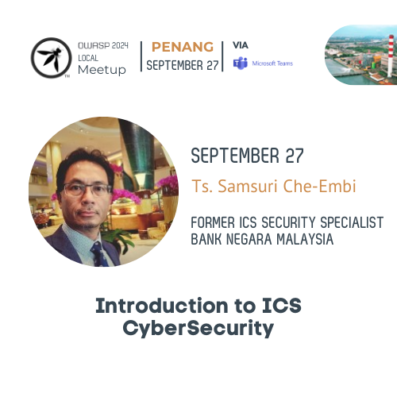

## Event

### OWASP Penang Meetup September 2024

<b> Fri, SEP 27 · 9:00 PM SST </b>
📅 Date: 27 September 2024
⏰ Time: 9:00 PM
💻 Venue: Microsoft Teams Meeting
🎤 Topic: Introduction to ICS CyberSecurity
👨‍💼 Speaker: Ts. Samsuri Che-Embi (Former ICS Security Specialist, Bank Negara Malaysia)

Join us for the second OWASP Penang Virtual Meetup! In this session, Ts. Samsuri Che-Embi will provide valuable insights into Industrial Control Systems (ICS) CyberSecurity, sharing his extensive experience in the field. This is a great opportunity to deepen your understanding of the critical importance of securing ICS environments in today’s cybersecurity landscape.

📌 Book your slot now (https://www.meetup.com/owasp-penang-chapter/events/303660679/)
20 minutes will be used for QnA or other discussions for future meetups.
Don’t miss out on this engaging and informative event!

Regards,
OWASP Penang Chapter Team
