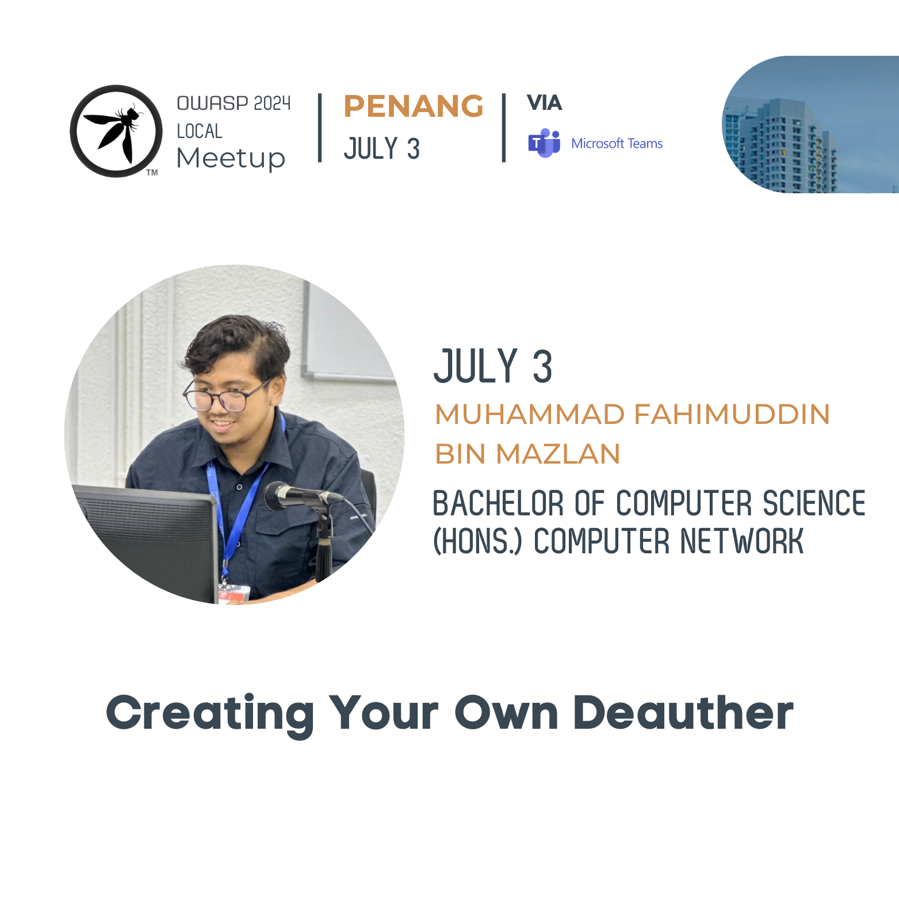
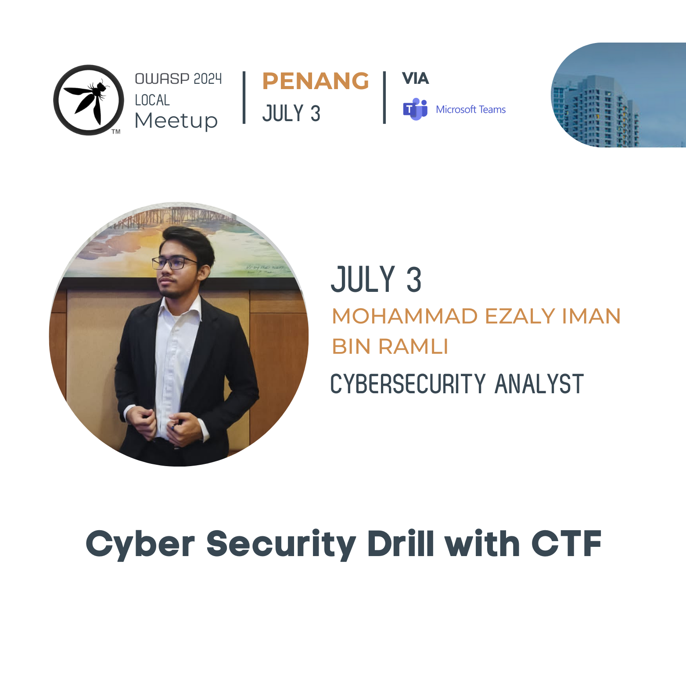
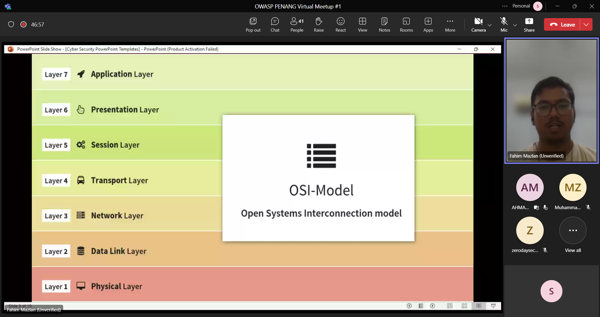
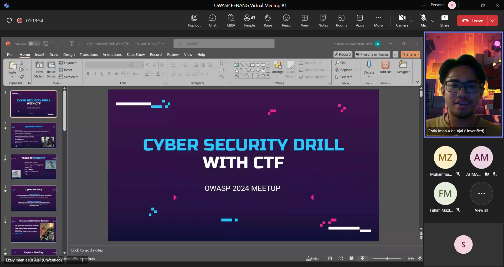
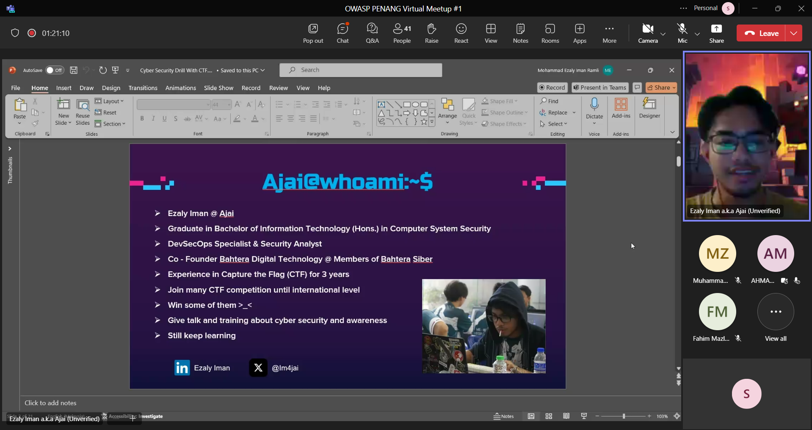

## OWASP Penang - Past Events

---

### OWASP Penang Meetup July 2024

<b> WED, JUL 3 · 9:00 PM SST </b>

Our First Online Meetup for 2024 is scheduled

Let's join together and build a Strong Cyber Security Community here in Penang, Malaysia.

The OWASP Malaysia Federation is delighted to introduce the OWASP Penang Chapter to everyone. Join us for an online meet-and-greet event with OWASP Penang on July 3, 2024. We will feature young speakers who will present exciting and up-to-date topics related to the world of cybersecurity. Don't miss this opportunity!

OWASP Malaysia Federation dengan berbesar hati ingin memperkenalkan OWASP Penang Chapter kepada semua. Sertai kami dalam acara suai kenal secara dalam talian bersama OWASP Penang pada 3 Julai 2024. Kami akan menampilkan penceramah muda yang akan mempersembahkan topik-topik menarik dan terkini berkaitan dengan dunia keselamatan siber. Jangan lepaskan peluang ini!

1. Time: 03/07/2024 9:00PM
2. Platform: Microsoft Teams

3. Speaker 1 : Muhammad Fahimuddin Bin Mazlan
 Topic: Creating Your Own Deauther

5. Speaker 2: Mohammad Ezaly Iman Bin Ramli
 Topic: Cyber Security Drill With CTF

20 minutes will be used for QnA or other discussions for future meetups.

It's a wrap ! 

**Social Updates:**

- LinkedIn - [Post Event Recap](https://www.linkedin.com/posts/owaspmalaysia_we-are-thrilled-to-share-that-our-recent-activity-7214279037664288769-7pVa)

---

### OWASP Penang Meetup September 2024

<b> Fri, SEP 27 · 9:00 PM SST </b>
📅 Date: 27 September 2024
 
⏰ Time: 9:00 PM
 
💻 Venue: Microsoft Teams Meeting
 
 

 
🎤 Topic: Introduction to ICS CyberSecurity
 
👨‍💼 Speaker: Ts. Samsuri Che-Embi (Former ICS Security Specialist, Bank Negara Malaysia)
 
Join us for the second OWASP Penang Virtual Meetup! In this session, Ts. Samsuri Che-Embi will provide valuable insights into Industrial Control Systems (ICS) CyberSecurity, sharing his extensive experience in the field. This is a great opportunity to deepen your understanding of the critical importance of securing ICS environments in today’s cybersecurity landscape.

📌 Book your slot now [Meetup]([https://www.meetup.com/owasp-penang-chapter/events/303660679/](https://www.meetup.com/owasp-penang-chapter/events/303660679/?utm_medium=referral&utm_campaign=share-btn_savedevents_share_modal&utm_source=link))
 
20 minutes will be used for QnA or other discussions for future meetups.
 
Don’t miss out on this engaging and informative event!

It's a wrap ! 

**Social Updates:**

- LinkedIn - [Post Event Recap](https://www.linkedin.com/posts/owaspmalaysia_owasp-penang-virtual-meetup-2-has-ended-activity-7245458920796741633--4y_?utm_source=share&utm_medium=member_desktop)

---

Regards,
OWASP Penang Chapter 
